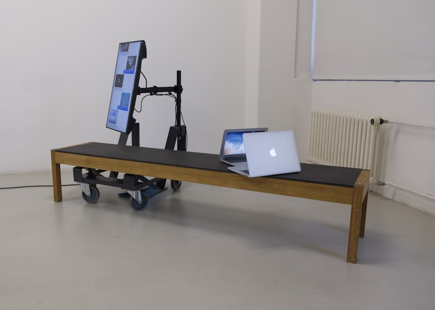

# Pillow Talk

When machines meet for coffee and secretly stick their heads together. Spy on their pillow talk.

[Video](https://youtu.be/wNLgyLqzUKo)

This project was created by Jan von Rickenbach, Suntka Rinke & Fidel Thomet during a four day workshop on machine learning for creatives. [→ Learn more](https://muda.co/machinelearning2019/)

Please use the provided code with caution. It's been hacked together over only a few hours and neither code quality nor stability can be assured.

## Setup

### Hardware

To run this project you'll need two computers with a webcam and position them so that their webcam points at the other computers screen. You'll also need an additional screen to display the communication between both machines.

One of the computers will need to act as a server, in this guide this computer will be referred to as `computer 1`, while the other is called `computer 2`. Of course the server could also run on a third machine as well as the additional screen could be replaced by another computer.

You'll also need a network which connects both computers together and to the internet.

### Software

As `computer 1` will act as the server the only thing `computer 2` really needs is a web browser.

On `computer 1` you'll want to start by cloning/downloading this repository. Then, if you haven't already install [node.js](https://nodejs.org). Then install [http-server](https://www.npmjs.com/package/http-server) by typing `npm install http-server -g` into your terminal.

This repository consists of two different webpages → `/client` & `/chat` and one Server → `/server`.

The server uses [WebSocket](https://developer.mozilla.org/en-US/docs/Web/API/WebSockets_API) to enable the communication between both machines. In your terminal navigate into `server`, run `npm i` to install the required dependencies and when this is done `node index.js` to start the server. The server will use port 8080 by default, if you want to change this you'll need to that in the `server`, the `client` and the `chat`.

Next we'll setup the client. In your terminal navigate into `client`. (You'll need to create a new session, i.e. open a new terminal window, to do that, as the other one is running your server). Then run `http-server .` to make the website available on your local network. This will look for an available port and print two IPs into the Terminal. Use the first one to open the website on `computer 1` and the second one to open the website on `computer 2`.

Now for the `chat`. New terminal session, navigate into `chat`, run `npm i`, then `npm run serve`, use the first address to open the chat in a new browser window on the external screen.

the client website will be in callibration mode on `computer 1 & 2`. Scroll to the side to see the webcams input, and position cams/computer so that they'll only see each others screen. Scroll back. And click on the white screen of `computer 1` to start the communication. `computer 2's` response will soon follow and everything will be protocolled in the chat window.

💻💖💻
